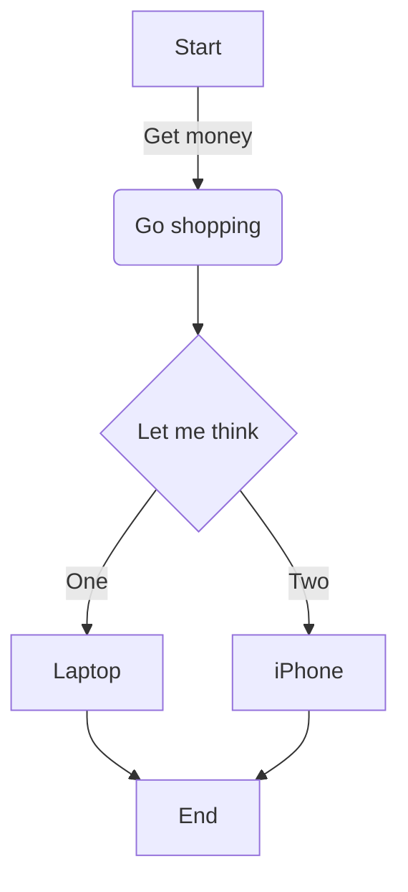
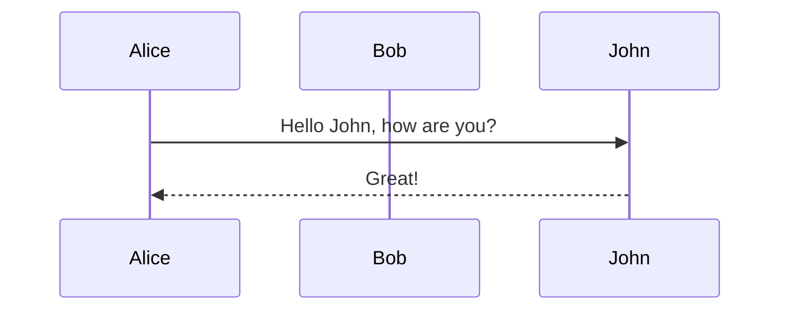
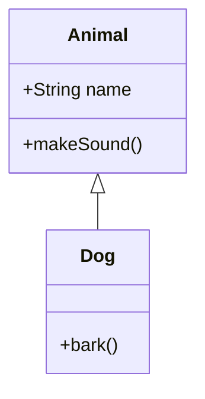
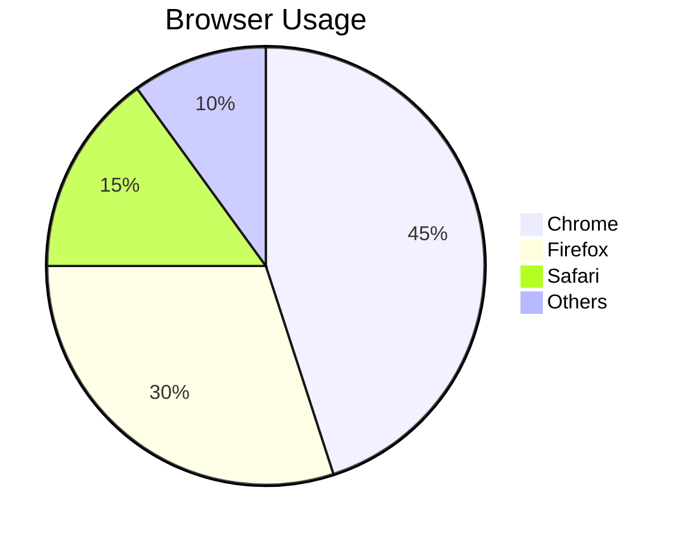

# 📦 GPT Markdown & LaTeX for Flutter

[](https://pub.dev/packages/gpt_markdown) [](https://pub.dev/packages/gpt_markdown) [](https://github.com/Infinitix-LLC/gpt_markdown)

A comprehensive Flutter package for rendering rich Markdown, LaTeX, Mermaid diagrams, and Vega-Lite charts in your apps, designed for seamless integration with AI outputs like ChatGPT and Gemini.

gpt_markdown is a drop-in replacement for flutter_markdown, offering extended support for LaTeX, custom builders, Mermaid diagrams, interactive Vega-Lite charts, and better AI integration for Flutter apps.

⭐ If you find this package helpful, please give it a like on [pub.dev](https://pub.dev/packages/gpt_markdown)! Your support means a lot! ⭐

---

## 📋 Table of Contents

- [Quick Start](#quick-start)
- [Supported Features](#supported-features)
- [Key Features](#key-features)
- [Installation](#installation)
- [Basic Usage](#basic-usage)
- [Advanced Features](#advanced-features)
  - [LaTeX Math](#latex-math)
  - [Mermaid Diagrams](#mermaid-diagrams)
  - [Vega-Lite Charts](#vega-lite-charts)
- [Customization](#customization)
- [Example App](#example-app)
- [Architecture](#architecture)
- [Contributing](#contributing)

---

## Quick Start

```dart
import 'package:flutter/material.dart';
import 'package:gpt_markdown/gpt_markdown.dart';

GptMarkdown(
  '# Hello World\n\nThis is **bold** text.',
  style: const TextStyle(color: Colors.black87),
)
```

---

## Supported Features

| ✨ Feature  | ✅ Supported |
| --- | --- |
| 💻 Code Blocks (with syntax highlighting) | ✅ |
| 📊 Tables | ✅ |
| 📝 Headings (H1-H6) | ✅ |
| 📌 Unordered Lists | ✅ |
| 📋 Ordered Lists | ✅ |
| 🔘 Radio Buttons | ✅ |
| ☑️ Checkboxes | ✅ |
| ➖ Horizontal Rules | ✅ |
| 🔢 LaTeX Math (inline & display) | ✅ |
| 💲 Dollar Sign LaTeX Support | ✅ |
| 📊 Mermaid Diagrams | ✅ |
| 📊 Vega-Lite Charts | ✅ |
| ↩️ Indentation | ✅ |
| ↩️ Block Quotes | ✅ |
| 🖼️ Images | ✅ |
| ✨ Highlighted Text | ✅ |
| ✂️ Strikethrough | ✅ |
| 🔵 Bold Text | ✅ |
| 📜 Italic Text | ✅ |
| 🔗 Links | ✅ |
| 📱 Selectable Content | ✅ |
| 🧩 Custom Components | ✅ |
| 📎 Underline | ✅ |
| 🌓 Theme Support (light/dark) | ✅ |
| 🌐 Multi-language (LTR/RTL) | ✅ |

---

## Installation

Run this command:

```bash
flutter pub add gpt_markdown
```

---

## Basic Usage

```dart
import 'package:flutter/material.dart';
import 'package:gpt_markdown/gpt_markdown.dart';

GptMarkdown(
  '''
  # Welcome to GPT Markdown
  
  * This is an unordered list
  * With multiple items
  
  **Bold text** and *italic text*
  ''',
  style: const TextStyle(color: Colors.black87),
)
```

---

## Advanced Features

### Custom Code Block Rendering

```dart
GptMarkdown(
  data,
  codeBuilder: (context, language, code, isClosed) {
    return Container(
      color: Colors.grey[900],
      padding: const EdgeInsets.all(12),
      child: Text(
        code,
        style: const TextStyle(
          fontFamily: 'monospace',
          color: Colors.white,
        ),
      ),
    );
  },
)
```

### Custom LaTeX Rendering

```dart
GptMarkdown(
  data,
  latexBuilder: (context, tex, textStyle, inline) {
    return Math.tex(
      tex,
      textStyle: textStyle,
    );
  },
  useDollarSignsForLatex: true, // Enable $...$ and $$...$$
)
```

### Custom Mermaid Diagram Rendering

```dart
GptMarkdown(
  data,
  mermaidBuilder: (context, code, style) {
    return MermaidWidget(
      mermaidCode: code,
      height: 400,
      theme: MermaidTheme.dark,
      fitToHeight: false,
    );
  },
  mermaidDefaultHeight: 400,
  mermaidDefaultWidth: double.infinity,
)
```

### Custom Vega-Lite Chart Rendering

```dart
GptMarkdown(
  data,
  vegaLiteBuilder: (context, spec, config) {
    return VegaLiteWidget(
      spec: spec,
      height: 400,
      fitToHeight: false,
    );
  },
  vegaLiteDefaultHeight: 400,
  vegaLiteDefaultWidth: double.infinity,
)
```

### Theme Customization

```dart
GptMarkdownTheme(
  gptThemeData: GptMarkdownThemeData(
    brightness: Brightness.dark,
    highlightColor: Colors.purple,
  ),
  child: GptMarkdown(data),
)
```

### Text Direction (RTL/LTR)

```dart
GptMarkdown(
  data,
  textDirection: TextDirection.rtl, // For Arabic, Hebrew, etc.
)
```

### Selectable Content

```dart
SelectionArea(
  child: GptMarkdown(data),
)
```

---

## Advanced Usage

### LaTeX Math Support

#### Inline Math
Use `\(...\)` syntax for inline equations:
```markdown
The equation \( E = mc^2 \) shows mass-energy equivalence.
```

#### Display Math
Use `\[...\]` syntax for display equations:
```markdown
\[
\int_{-\infty}^{\infty} e^{-x^2} \, dx = \sqrt{\pi}
\]
```

#### Dollar Sign Support
Enable with `useDollarSignsForLatex: true`:
```markdown
Inline: $E = mc^2$
Display: $$\sum_{i=1}^{n} i = \frac{n(n+1)}{2}$$
```

### Mermaid Diagrams

#### Flowchart
```markdown

```

#### Sequence Diagram
```markdown

```

#### Class Diagram
```markdown

```

#### Pie Chart
```markdown

```

#### Fit-to-Height Feature
Control scrolling behavior of Mermaid diagrams:
```dart
GptMarkdown(
  data,
  mermaidBuilder: (context, code, style) {
    return MermaidWidget(
      mermaidCode: code,
      height: 400,
      fitToHeight: true, // Disable scrolling, fit to height
    );
  },
)
```

### Vega-Lite Charts

#### Bar Chart
```markdown
```vega-lite
{
  "$schema": "https://vega.github.io/schema/vega-lite/v5.json",
  "data": {
    "values": [
      {"category": "A", "value": 28},
      {"category": "B", "value": 55}
    ]
  },
  "mark": "bar",
  "encoding": {
    "x": {"field": "category", "type": "nominal"},
    "y": {"field": "value", "type": "quantitative"}
  }
}
```
```

#### Line Chart
```markdown
```vega-lite
{
  "$schema": "https://vega.github.io/schema/vega-lite/v5.json",
  "data": {
    "values": [
      {"x": 1, "y": 10},
      {"x": 2, "y": 20}
    ]
  },
  "mark": {"type": "line", "point": true},
  "encoding": {
    "x": {"field": "x", "type": "quantitative"},
    "y": {"field": "y", "type": "quantitative"}
  }
}
```
```

#### Scatter Plot
```markdown
```vega-lite
{
  "$schema": "https://vega.github.io/schema/vega-lite/v5.json",
  "mark": "circle",
  "encoding": {
    "x": {"field": "x", "type": "quantitative"},
    "y": {"field": "y", "type": "quantitative"}
  }
}
```
```

#### Pie Chart
```markdown
```vega-lite
{
  "$schema": "https://vega.github.io/schema/vega-lite/v5.json",
  "mark": "arc",
  "encoding": {
    "theta": {"field": "value", "type": "quantitative"},
    "color": {"field": "label", "type": "nominal"}
  }
}
```
```

#### Supported Chart Types
- Bar charts
- Line charts
- Scatter plots
- Pie charts
- Area charts
- Grouped bar charts
- Heatmaps
- And more from Vega-Lite library

### Custom Builders

You can fully customize the rendering of any element:

```dart
GptMarkdown(
  data,
  codeBuilder: (context, language, code, closed) {
    // Custom code block
  },
  latexBuilder: (context, tex, textStyle, inline) {
    // Custom LaTeX rendering
  },
  linkBuilder: (context, label, path, style) {
    // Custom link rendering
  },
  imageBuilder: (context, url) {
    // Custom image rendering
  },
  tableBuilder: (context, tableRows, textStyle, config) {
    // Custom table rendering
  },
  mermaidBuilder: (context, code, style) {
    // Custom Mermaid rendering
  },
  vegaLiteBuilder: (context, spec, config) {
    // Custom Vega-Lite rendering
  },
)
```

---

## Example App

The package includes a comprehensive example app demonstrating all features:

```bash
cd example
flutter run -d chrome    # Web
flutter run              # Mobile/Desktop
```

### Features in Example App

- ✅ Live markdown editing with real-time preview
- ✅ Theme switching (light/dark mode)
- ✅ Text direction toggle (LTR/RTL)
- ✅ LaTeX dollar sign toggle
- ✅ Mermaid diagram "Fit to height" toggle
- ✅ File drag-and-drop support
- ✅ All markdown elements demonstrated
- ✅ Multiple Mermaid diagram types
- ✅ 6+ Vega-Lite chart examples

### Example Content

The default example includes:
- Complex markdown formatting
- Mathematical equations
- Mermaid flowcharts and diagrams
- Interactive Vega-Lite charts:
  - Bar chart (sales by category)
  - Line chart (temperature trends)
  - Scatter plot (correlation analysis)
  - Pie chart (market share)
  - Area chart (revenue growth)
  - Grouped bar chart (product comparison)

---

## Architecture

### Component-Based Design

The package uses a modular component architecture where each markdown element is a separate component:

```
MarkdownComponent (Base)
├── BlockMd (Block-level elements)
│   ├── CodeBlockMd
│   ├── HTag (Headers)
│   ├── MermaidBlockMd
│   ├── VegaLiteBlockMd
│   ├── TableMd
│   └── ...
└── InlineMd (Inline elements)
    ├── BoldMd
    ├── ItalicMd
    ├── LatexMath
    └── ...
```

### Configuration System

Centralized configuration through `GptMarkdownConfig`:
- Custom builder functions for styling
- Theme integration via `GptMarkdownTheme`
- Text direction and alignment control
- LaTeX customization options

### Rendering Pipeline

```
Markdown Input
    ↓
MarkdownComponent.generate() (Parsing)
    ↓
globalComponents (Block-level processing)
    ↓
inlineComponents (Inline processing)
    ↓
Custom Builders (Styling/Customization)
    ↓
Flutter Widgets (Output)
```

### LaTeX Integration

Uses `flutter_math_fork` for LaTeX rendering with support for:
- Standard LaTeX: `\(...\)` and `\[...\]`
- Dollar signs: `$...$` and `$$...$$`
- Custom workarounds via `latexWorkaround` function

### Mermaid Integration

Uses Mermaid.js via WebView for interactive diagrams:
- Standard Mermaid syntax: ````mermaid ... ``` blocks
- Cross-platform support
- Configurable themes (default, dark, forest, neutral)
- Responsive CSS with fit-to-height mode

### Vega-Lite Integration

Uses Vega-Lite and vega-embed via CDN:
- Interactive data visualization
- Responsive rendering
- Cross-platform web rendering
- Multiple chart types supported
- Tooltip and interaction support

---

## Customization Guide

### Adding Custom Markdown Components

```dart
class MyCustomComponent extends BlockMd {
  @override
  RegExp get exp => RegExp(r'your pattern here');
  
  @override
  InlineSpan span(BuildContext context, String text, GptMarkdownConfig config) {
    // Return your widget/span here
  }
}

// Use in GptMarkdown
GptMarkdown(
  data,
  components: [
    MyCustomComponent(),
    // ... other components
  ],
)
```

### Theme Customization

```dart
GptMarkdownTheme(
  gptThemeData: GptMarkdownThemeData(
    brightness: Brightness.dark,
    highlightColor: Colors.purple,
  ),
  child: GptMarkdown(data),
)
```

---

## Platform Support

- ✅ **Web** (Chrome, Firefox, Safari, Edge)
- ✅ **Android**
- ✅ **iOS**
- ✅ **macOS**
- ✅ **Windows**
- ✅ **Linux**

All diagrams (Mermaid) and charts (Vega-Lite) render via web technologies on all platforms.

---

## Performance Optimization

### For Large Documents
- Markdown parsing is O(n) with regex-based component matching
- Lazy rendering for off-screen content
- Efficient widget tree updates

### For Diagrams
- Asynchronous rendering via WebView/HtmlElementView
- CDN libraries are cached in the browser
- Minimal overhead per diagram

---

## Troubleshooting

### LaTeX not rendering
- Ensure `flutter_math_fork` is installed
- Check that LaTeX syntax is correct (`\(` and `\)` or `$` and `$`)
- Verify `useDollarSignsForLatex` is set correctly

### Mermaid diagrams not showing
- Check browser console for rendering errors
- Ensure CDN is accessible
- Verify Mermaid syntax is correct

### Vega-Lite charts not rendering
- Ensure CDN (jsdelivr.net) is accessible
- Verify JSON spec is valid
- Check that spec matches Vega-Lite v5 schema

### Charts showing but scrolling
- Enable `fitToHeight: true` mode
- Adjust container `height` parameter
- Check responsive width settings

---

## Contributing

We welcome contributions! Please see [CONTRIBUTING.md](CONTRIBUTING.md) for guidelines.

---

## Dependencies

**Core Dependencies:**
- `flutter_math_fork: ^0.7.0` - LaTeX rendering
- `webview_flutter: ^4.0+` - Web content rendering
- `desktop_drop: ^0.3.0+` - Drag and drop support (example app)

**CDN Dependencies (loaded at runtime):**
- Mermaid.js 11.x
- Vega 5.28.0
- Vega-Lite 5.18.0
- vega-embed 6.26.0

---

## API Reference

### GptMarkdown Widget

Main widget for rendering markdown content.

```dart
GptMarkdown(
  String data, {
  Key? key,
  TextStyle? style,
  TextDirection textDirection = TextDirection.ltr,
  TextAlign? textAlign,
  TextScaler? textScaler,
  bool useDollarSignsForLatex = false,
  bool followLinkColor = false,
  int? maxLines,
  TextOverflow? overflow,
  Function(String tex)? latexWorkaround,
  Function(String url, String title)? onLinkTap,
  // Builders
  LatexBuilder? latexBuilder,
  CodeBlockBuilder? codeBuilder,
  LinkBuilder? linkBuilder,
  ImageBuilder? imageBuilder,
  HighlightBuilder? highlightBuilder,
  SourceTagBuilder? sourceTagBuilder,
  OrderedListBuilder? orderedListBuilder,
  UnOrderedListBuilder? unOrderedListBuilder,
  TableBuilder? tableBuilder,
  MermaidBuilder? mermaidBuilder,
  VegaLiteBuilder? vegaLiteBuilder,
  // Defaults
  double? mermaidDefaultHeight,
  double? mermaidDefaultWidth,
  double? vegaLiteDefaultHeight,
  double? vegaLiteDefaultWidth,
  // Components
  List<MarkdownComponent>? components,
  List<MarkdownComponent>? inlineComponents,
})
```

### MermaidWidget

Widget for rendering Mermaid diagrams.

```dart
MermaidWidget(
  String mermaidCode,
  {
  double? height,
  double? width,
  Color? backgroundColor,
  MermaidTheme theme = MermaidTheme.default_,
  bool fitToHeight = false,
  }
)
```

### VegaLiteWidget

Widget for rendering Vega-Lite charts.

```dart
VegaLiteWidget(
  String spec,
  {
  double? height,
  double? width,
  Color? backgroundColor,
  bool fitToHeight = false,
  }
)
```

---

## License

[See LICENSE file](LICENSE)

---

## Additional Resources

- **GitHub**: [Infinitix-LLC/gpt_markdown](https://github.com/Infinitix-LLC/gpt_markdown)
- **Pub.dev**: [gpt_markdown package](https://pub.dev/packages/gpt_markdown)
- **Example App**: See `example/` directory
- **Mermaid Documentation**: [mermaid.js.org](https://mermaid.js.org)
- **Vega-Lite Documentation**: [vega.github.io/vega-lite](https://vega.github.io/vega-lite)

---

## Support

If you encounter any issues or have questions:
1. Check the [Example App](example/)
2. Review [GitHub Issues](https://github.com/Infinitix-LLC/gpt_markdown/issues)
3. Create a new issue with a detailed description

---

**Version**: 2.0+  
**Last Updated**: November 2025  
**Status**: Production Ready ✅

